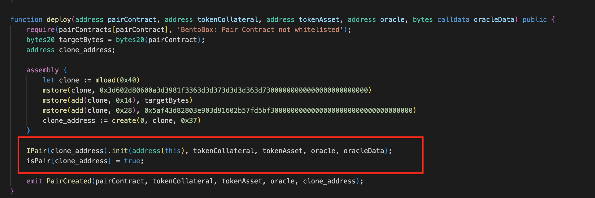
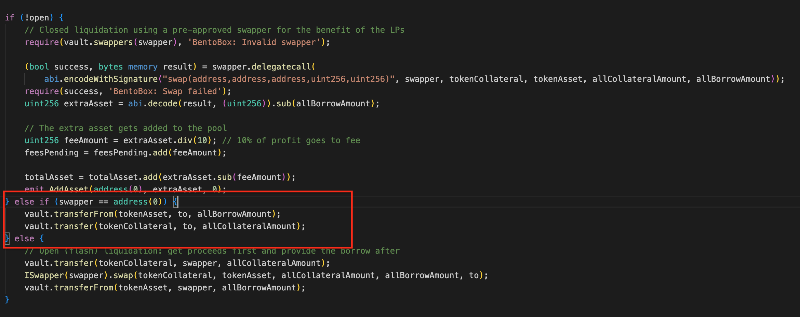

# Boringcrypto Lending Protocol
## Project Description
This project is an lending protocol deployed by `boringcrypto.eth` with features such as flash loans, pair deployment, and fee management. When a user initiates a lending operation, the `deploy` function of the `Vault` contract is invoked to facilitate the process. This function deploys a proxy contract for a new lending pair based on a predefined Pair contract template, as well as the `tokenCollateral` and price `oracle`.

The `Pair` contract implements the specific lending protocol logic. It includes functions such as adding collateral `addCollateral()`, removing collateral `removeCollateral()`, adding assets `addAsset()`, removing assets `removeAsset()`, and executing liquidation `liquidate()`. Each time a liquidation is executed, a specific liquidator carries out the process and receives a portion of the borrower’s collateral based on a predefined ratio.

## Vulnerable Contracts
- Vault Contract：https://etherscan.io/address/0xfbbe6bd840affc96547854a1f821d797a8c662d9#code
- Pair Contract(Logic): https://etherscan.io/address/0xf541947cbb87fb3b7ca81dae9c66831167ea9f8c#code

## Attack Vectors
### Vulnerability Type
- Insufficient access control
- Insufficient external parameter validation

### Vulnerability Description
External users create a trading pair `Pair` contract by calling the `deploy` function of the `Vault` contract. However, the `deploy` function does not validate the legitimacy of the `tokenCollateral` and `oracle` passed by the external user. In other words, users can pass any fake token and manipulate the `exchangeRate` through the `oracle`.

There is also a serious issue in the implementation of the `Pair` contract. The `liquidate()` method allows the function caller to specify **any liquidator** to execute the liquidation of the collateral. This is problematic because it introduces the potential for malicious actors to arbitrarily choose liquidators, which can lead to the enforcement of liquidation procedures.

### Reproduction Steps
- By using a malicious token contract as `collateral`, a custom `oracle`, and a valuable token (such as `USDC`), the attacker can deploy a `Pair` contract by calling the `deploy()` method of the `Vault` contract with these three parameters.
- Since the protocol itself does not have a value token, the attacker first calls the `addAsset()` method to deposit a certain amount of value tokens and then calls the `addBorrow` method to use the malicious token as collateral and borrow the corresponding amount of value tokens.
- The attacker can manipulate the collateral’s value by controlling the oracle’s rate, making the collateral insufficient to cover the value of the borrowed tokens.
- The attacker forces a `liquidation` of their own position and specifies a custom to address as the `liquidator`, allowing the `liquidator` to complete the liquidation transfer.
- Finally, the attacker calls the `removeAsset` method to withdraw the deposited value tokens, causing financial losses for the `liquidator`.

## Mitigation Measures
Once the contract is deployed, the code cannot be changed. To mitigate the impact of this vulnerability:
- For the contract deployer: Upgrade the implementation of the `Pair` contract, modify the liquidation logic, and add validation for tokens.
- The liquidator should immediately stop the `Approve` operations for the `Vault` contract address.

