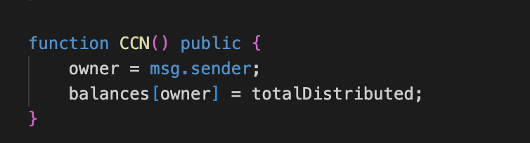
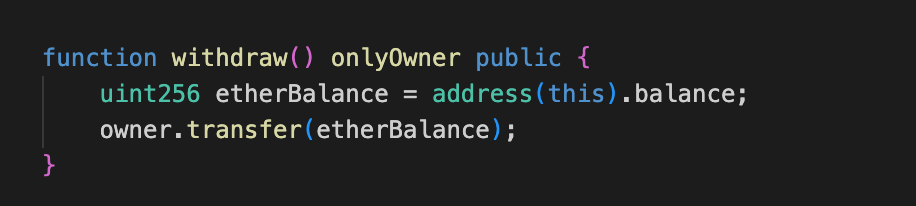

# CryptoCurrencyNetwork Token

## Project Description
The project is a smart contract for a cryptocurrency network token called `CryptoCurrencyNetwork (CCN)`. It allows users to claim tokens through the `getTokens()` function by sending ETH to the contract, with the number of tokens distributed being controlled by a distribution mechanism and governed by a whitelist.

## Vulnerable Contracts
- CryptoCurrencyNetwork Contract: https://etherscan.io/address/0x781fB4f25d07DE3f3CFe2476645E52e0C661eEfC#code
## Attack Vectors
### Vulnerability Type
- Owner Privilege Escalation

### Vulnerability Description
The CryptoCurrencyNetwork contract has a vulnerability in its fake "constructor" function `CCN()` which is publicly accessible. This allows any external user to invoke the function and set themselves as the contract `owner`.

Once a user becomes the owner, they can bypass the `onlyOwner` modifier, allowing them to perform sensitive actions like `withdraw` etherBalance.

### Reproduction Steps
- Any external user can call the public `CCN()` function. 
- Upon calling the function, the caller becomes the contract `owner`, taking full control of the contract. 
- The attacker can now interact with all owner-specific functions like `finishDistribution()`, `withdraw()`, and `burn()`.

## Mitigation Measures
Mitigation Measures: Since the contract cannot be modified once deployed, any user should stop interacting with the contract, especially `transfer` operations.
